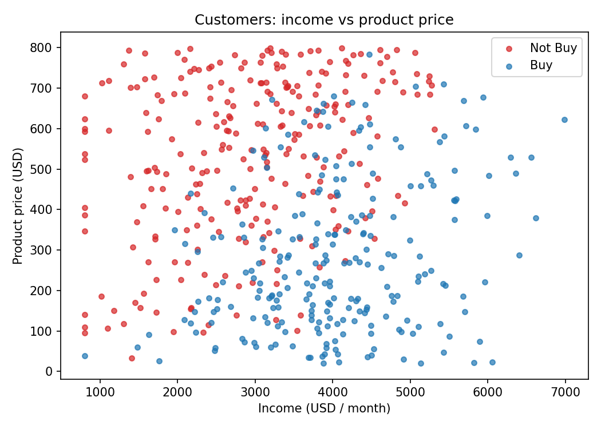
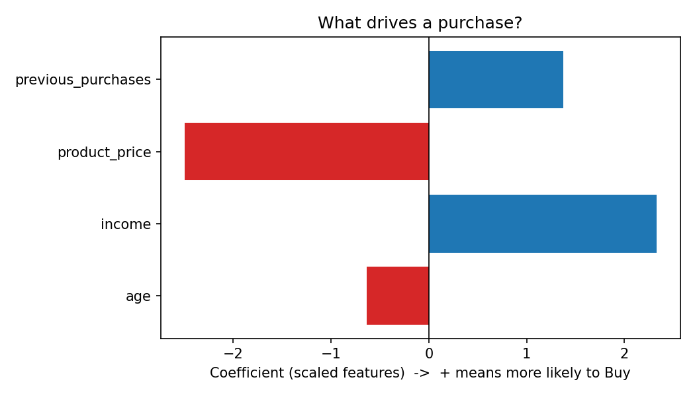
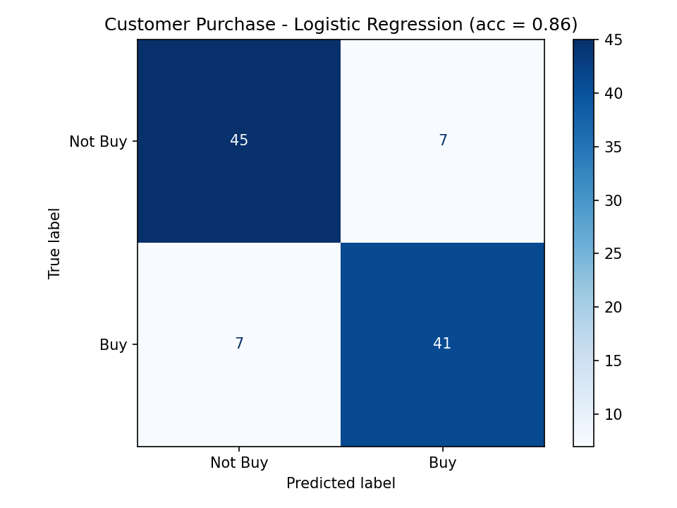

# Task 4 – Customer Purchase Prediction with Logistic Regression

**Goal:** predict whether a customer will **Buy** or **Not Buy** a product
from their age, income, the product price and their previous purchases.

| Item | Value |
|---|---|
| Model | Logistic Regression (scikit-learn) |
| Data | 500 customers (4 features + 1 target) |
| Train / Test | 400 / 100 (80 % / 20 %) |
| **Accuracy** | **0.86 (86 %)** |

---

## Requirements – answers at a glance

| # | Requirement | Answer |
|---|---|---|
| 1 | Problem statement | Predict whether a customer will **Buy** or **Not Buy** a product. It is a **binary classification** problem. |
| 2 | Features (X) | `age`, `income`, `product_price`, `previous_purchases` |
| 3 | Target (y) | `purchased` → **1 = Buy**, **0 = Not Buy** (238 Buy / 262 Not Buy) |
| 4 | Train / test split | 80 % train (400 rows), 20 % test (100 rows), `stratify=y`, `random_state=42` |
| 5 | Model | `StandardScaler` + `LogisticRegression` in a `Pipeline`, trained with `.fit()` |
| 6 | Predictions | `model.predict(X_test)` gives Buy / Not Buy for all 100 test customers |
| 7 | Accuracy | **0.86**, so 86 of the 100 test customers were predicted correctly |
| 8 | Confusion matrix | TN = 45, FP = 7, FN = 7, TP = 41 (see the picture in section 8) |
| 9 | 5+ predicted examples | 8 test customers + 2 new customers (see the tables in section 9) |
| 10 | Explanation | 4 sentences in section 10 |

---

## 1. Problem statement

A shop wants to know **which customers are likely to buy** a product, so it
can target offers at them. The answer is one of two classes (Buy / Not Buy),
so we use **Logistic Regression**, a classification model.

Linear regression predicts a number. Logistic regression puts that number
through the **sigmoid function**, which turns it into a probability between 0 and 1:

```
z      = b0 + b1·age + b2·income + b3·price + b4·previous
P(Buy) = 1 / (1 + e^(-z))
If P(Buy) ≥ 0.5  →  Buy   else  →  Not Buy
```

## 2. Features (X)

| Feature | Meaning | Range |
|---|---|---|
| `age` | Customer age | 18 – 65 years |
| `income` | Monthly income | ~800 – 8,000 USD |
| `product_price` | Price of the product | 20 – 800 USD |
| `previous_purchases` | Times the customer bought before | 0 – ~10 |

> **About the data:** the task sheet gives no dataset, so `customer_purchase.py`
> generates 500 realistic customers with a fixed random seed. You get the same
> data every run. Buying is made more likely by higher income and more previous
> purchases, less likely by higher price, with random noise so the model can't
> be perfect. The data is saved to `customer_purchase.csv`.



*Blue (Buy) points sit mostly at **high income and low price**. Red (Not Buy)
points sit at **low income and high price**. The overlap in the middle is where
the model will make mistakes.*

## 3. Target (y)

```python
features = ["age", "income", "product_price", "previous_purchases"]
X = df[features]
y = df["purchased"]          # 1 = Buy, 0 = Not Buy
```

The classes are almost balanced: **238 Buy** and **262 Not Buy**.

## 4. Split into training and testing sets

```python
X_train, X_test, y_train, y_test = train_test_split(
    X, y, test_size=0.2, random_state=42, stratify=y)
```

- **400** customers are used to train the model and **100** are hidden for testing.
- `stratify=y` keeps the same Buy / Not Buy ratio in both parts.
- `random_state=42` makes the split the same every run.

## 5. Create and train the Logistic Regression model

```python
model = Pipeline([
    ("scaler", StandardScaler()),       # put all features on the same scale
    ("logreg", LogisticRegression()),
])
model.fit(X_train, y_train)
```

**Why the scaler?** Income is in the thousands, while previous purchases run
from 0 to about 10. Scaling gives every feature a fair chance, and it lets us
compare the coefficients directly.

**Learned coefficients:**

| Feature | Coefficient | Effect |
|---|---|---|
| `product_price` | **−2.50** | Higher price → much **less** likely to buy |
| `income` | **+2.33** | Higher income → much **more** likely to buy |
| `previous_purchases` | +1.37 | Loyal customers → more likely to buy |
| `age` | −0.63 | Older customers → slightly less likely to buy |
| intercept | −0.25 | |



## 6. Make predictions on the test set

```python
y_pred = model.predict(X_test)                 # 0 or 1 for each customer
y_prob = model.predict_proba(X_test)[:, 1]     # probability of Buy
```

## 7. Accuracy

```python
acc = accuracy_score(y_test, y_pred)   # 0.86
```

**Accuracy = correct predictions / all predictions = (45 + 41) / 100 = 0.86**

| Class | Precision | Recall | F1 |
|---|---|---|---|
| Not Buy | 0.87 | 0.87 | 0.87 |
| Buy | 0.85 | 0.85 | 0.85 |

## 8. Confusion matrix

```python
cm = confusion_matrix(y_test, y_pred)
ConfusionMatrixDisplay(cm, display_labels=["Not Buy", "Buy"]).plot(cmap="Blues")
```



| | Predicted Not Buy | Predicted Buy |
|---|---|---|
| **Actual Not Buy** | **45** (TN, correct) | 7 (FP, said Buy but they didn't) |
| **Actual Buy** | 7 (FN, missed a buyer) | **41** (TP, correct) |

- **Correct:** 45 + 41 = **86**
- **Wrong:** 7 + 7 = **14**, split evenly between the two kinds of mistake

## 9. Predicted examples

**Customers from the test set:**

| Age | Income | Price | Prev. purchases | P(Buy) | Predicted | Actual | Correct? |
|---|---|---|---|---|---|---|---|
| 44 | 4,477 | 384.76 | 6 | 0.988 | Buy | Buy | ✅ |
| 50 | 3,270 | 128.15 | 3 | 0.904 | Buy | Not Buy | ❌ |
| 52 | 2,950 | 361.63 | 3 | 0.263 | Not Buy | Not Buy | ✅ |
| 64 | 4,449 | 35.42 | 3 | 0.992 | Buy | Buy | ✅ |
| 61 | 5,897 | 74.32 | 3 | 0.999 | Buy | Buy | ✅ |
| 24 | 4,205 | 156.77 | 2 | 0.985 | Buy | Buy | ✅ |
| 23 | 4,955 | 127.02 | 1 | 0.994 | Buy | Buy | ✅ |
| 56 | 2,393 | 115.14 | 0 | 0.121 | Not Buy | Not Buy | ✅ |

7 out of 8 are correct. The mistake (row 2) is a customer with a cheap product
and average income. The model was fairly sure they'd buy, but they didn't. Real
people don't always follow the pattern.

**Two brand-new customers:**

| Age | Income | Price | Prev. purchases | P(Buy) | Prediction |
|---|---|---|---|---|---|
| 25 | 6,000 | 150 | 6 | ≈ 1.00 | **Buy** |
| 50 | 2,000 | 700 | 0 | ≈ 0.00 | **Not Buy** |

```python
new = pd.DataFrame({"age": [25, 50], "income": [6000, 2000],
                    "product_price": [150, 700], "previous_purchases": [6, 0]})
model.predict(new)          # -> [1, 0]  = Buy, Not Buy
```

## 10. Explanation of the result

The Logistic Regression model predicted Buy / Not Buy correctly for **86 % of
the 100 test customers**. **Product price** has the strongest negative effect:
expensive products are much less likely to be bought. **Higher income** and
**more previous purchases** raise the chance of buying, and older customers are
slightly less likely to buy. The confusion matrix shows **14 mistakes** (7 false
Buy, 7 missed buyers); 10 of them had a predicted probability between 0.2 and
0.8, so they were borderline customers. Because the classes are balanced and the
errors are split evenly, accuracy is a fair summary here, and the model is useful
for deciding which customers to target with offers.

---

## How to run

```bash
pip install numpy pandas scikit-learn matplotlib
python3 customer_purchase.py
```

Running it prints every step, saves the three pictures and writes `customer_purchase.csv`.
The full printed output is saved in `output.txt`.
